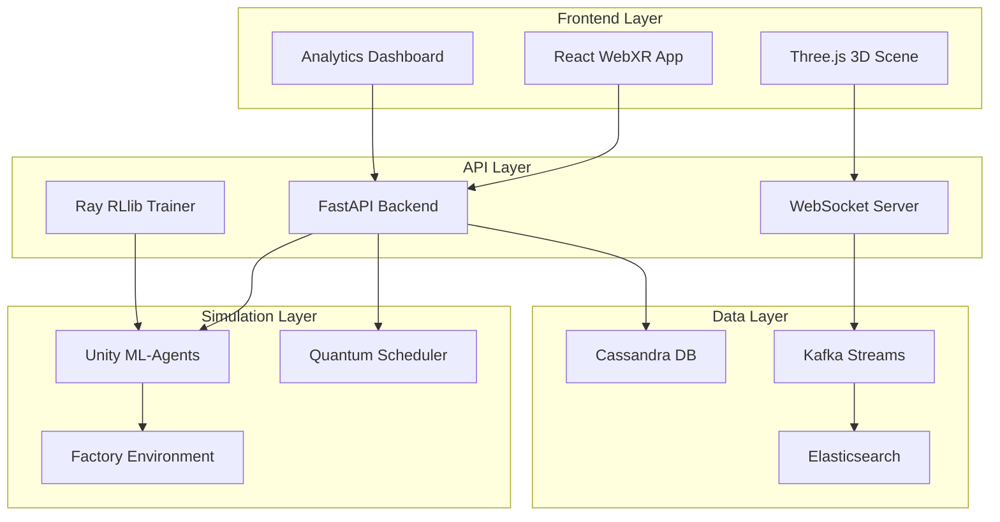

# Cross-Reality Digital Twin & Reinforcement Learning Lab

A cutting-edge simulation environment that combines Unity ML-Agents, reinforcement learning, quantum-inspired optimization, and WebXR technologies for next-generation manufacturing intelligence.


## 🌟 Features

### 🏭 Digital Twin Simulation
- **Unity ML-Agents Integration**: Real-time factory simulation with intelligent agents
- **WebXR Support**: Immersive VR/AR experiences for factory visualization
- **Real-time Metrics**: Live performance monitoring and analytics
- **Anomaly Detection**: AI-powered detection of production inefficiencies

### 🧠 Machine Learning & AI
- **Reinforcement Learning**: Multi-agent training using Ray RLlib
- **Multiple Algorithms**: Support for PPO, DQN, SAC, and A3C
- **Distributed Training**: Scalable training across multiple workers
- **Hyperparameter Tuning**: Automated optimization with Ray Tune

### ⚛️ Quantum Computing
- **Quantum Optimization**: Factory scheduling using Qiskit QAOA
- **Hybrid Algorithms**: Classical-quantum comparison and optimization
- **Real Quantum Hardware**: Support for IBM Quantum devices
- **Performance Analysis**: Quantum advantage measurement

### 📊 Analytics & Monitoring
- **Real-time Dashboards**: Live performance visualization
- **Time-series Analytics**: Historical trend analysis
- **Predictive Maintenance**: ML-powered equipment monitoring
- **Custom Metrics**: Configurable KPIs and alerts

### ☁️ Cloud-Native Architecture
- **Kubernetes Deployment**: Scalable container orchestration
- **Microservices**: Modular, maintainable architecture
- **CI/CD Pipeline**: Automated testing and deployment
- **Multi-cloud Support**: GCP, AWS, Azure compatibility

## 🚀 Quick Start

### Prerequisites

- **Docker & Docker Compose** (for local development)
- **Node.js 18+** (for frontend development)
- **Python 3.9+** (for backend development)
- **kubectl** (for Kubernetes deployment)
- **Terraform** (for cloud infrastructure)

### Local Development Setup

1. **Clone the repository**
   ```bash
   git clone https://github.com/your-org/factory-digital-twin.git
   cd factory-digital-twin
   ```

2. **Run the setup script**
   ```bash
   chmod +x scripts/setup.sh
   ./scripts/setup.sh
   ```

3. **Start the development environment**
   ```bash
   # Start infrastructure services
   docker-compose up -d cassandra kafka elasticsearch
   
   # Start frontend
   npm run dev
   
   # Start backend (in another terminal)
   npm run start:backend
   ```

4. **Access the applications**
   - **Frontend**: http://localhost:3000
   - **Backend API**: http://localhost:8000
   - **Ray Dashboard**: http://localhost:8265
   - **Grafana**: http://localhost:3001
   - **Kibana**: http://localhost:5601

## 🏗️ Architecture

### System Overview



### Technology Stack

| Component | Technology | Purpose |
|-----------|------------|---------|
| **Frontend** | React + TypeScript | User interface and WebXR |
| **3D Graphics** | Three.js + React Three Fiber | 3D visualization |
| **WebXR** | @react-three/xr | VR/AR experiences |
| **Backend** | FastAPI + Python | REST API and ML orchestration |
| **ML Training** | Ray RLlib | Distributed reinforcement learning |
| **Simulation** | Unity ML-Agents | Factory environment simulation |
| **Quantum** | Qiskit | Quantum optimization algorithms |
| **Database** | Apache Cassandra | Time-series data storage |
| **Streaming** | Apache Kafka | Real-time data processing |
| **Analytics** | Apache Spark | Big data processing |
| **Search** | Elasticsearch | Log aggregation and search |
| **Monitoring** | Prometheus + Grafana | Metrics and visualization |
| **Orchestration** | Kubernetes | Container management |
| **Infrastructure** | Terraform | Cloud resource management |

## 📱 Application Modules

### 1. Dashboard
- **System Status**: Real-time health monitoring
- **Performance Metrics**: KPI tracking and visualization
- **Simulation Controls**: Start/stop/configure simulations
- **Agent Management**: Monitor ML agent performance

### 2. WebXR Lab
- **3D Factory Visualization**: Interactive 3D factory model
- **VR/AR Support**: Immersive experiences with WebXR
- **Real-time Updates**: Live simulation data integration
- **Interactive Controls**: Manipulate simulation parameters

### 3. Analytics
- **Performance Trends**: Historical efficiency analysis
- **Anomaly Detection**: AI-powered issue identification
- **Predictive Analytics**: Forecasting and optimization
- **Custom Reports**: Configurable analytics dashboards

### 4. RL Training
- **Algorithm Selection**: Choose from PPO, DQN, SAC, A3C
- **Hyperparameter Tuning**: Automated optimization
- **Training Monitoring**: Real-time training progress
- **Model Management**: Save, load, and compare models

### 5. Quantum Optimization
- **Scheduling Optimization**: Quantum-enhanced task scheduling
- **Circuit Visualization**: Quantum circuit design and analysis
- **Performance Comparison**: Quantum vs classical algorithms
- **Hardware Integration**: Real quantum device support

### 6. Infrastructure
- **Cluster Management**: Kubernetes cluster monitoring
- **Resource Utilization**: CPU, memory, and GPU tracking
- **Cost Analysis**: Cloud spending optimization
- **Service Health**: Microservice status monitoring

## 🔧 Configuration

### Environment Variables

Create a `.env` file based on `.env.example`:

```bash
# Application
APP_NAME="Factory Digital Twin"
ENVIRONMENT="development"

# API Configuration
API_HOST="0.0.0.0"
API_PORT="8000"

# Unity Simulation
UNITY_HOST="localhost"
UNITY_PORT="9000"

# Database
CASSANDRA_HOST="localhost"
CASSANDRA_PORT="9042"

# Kafka
KAFKA_BOOTSTRAP_SERVERS="localhost:9092"

# Cloud Configuration (for production)
GCP_PROJECT_ID="your-project-id"
GCP_REGION="us-central1"
```

### Docker Compose Services

The `docker-compose.yml` includes:

- **Cassandra**: Time-series database
- **Kafka + Zookeeper**: Message streaming
- **Elasticsearch + Kibana**: Search and analytics
- **Unity Simulation**: ML-Agents environment
- **Backend Services**: FastAPI + Ray
- **Prometheus + Grafana**: Monitoring stack

## 🚀 Deployment

### Local Development
```bash
docker-compose up -d
npm run dev
```

### Kubernetes Deployment
```bash
# Apply Kubernetes manifests
kubectl apply -f k8s/

# Or use Helm
helm install factory-digital-twin ./helm/factory-digital-twin
```

### Cloud Deployment (GCP)
```bash
# Initialize Terraform
cd terraform
terraform init
terraform plan
terraform apply

# Deploy with Helm
./scripts/deploy.sh production
```

## 🧪 Testing

### Frontend Tests
```bash
npm run test
npm run lint
```

### Backend Tests
```bash
cd backend
pytest tests/ --cov=.
flake8 . --count --select=E9,F63,F7,F82
black --check .
```

### Integration Tests
```bash
# Run with Docker Compose
docker-compose -f docker-compose.test.yml up --abort-on-container-exit
```

## 📊 Monitoring & Observability

### Metrics Collection
- **Prometheus**: System and application metrics
- **Grafana**: Visualization and alerting
- **Elasticsearch**: Log aggregation
- **Kibana**: Log analysis and visualization

### Key Metrics
- **Production Efficiency**: Overall factory performance
- **Agent Performance**: ML agent training progress
- **System Health**: Infrastructure resource utilization
- **Quantum Performance**: Quantum algorithm effectiveness

### Alerting
- **Performance Degradation**: Efficiency drops below threshold
- **System Failures**: Service outages or errors
- **Resource Exhaustion**: High CPU/memory usage
- **Training Issues**: ML training failures or convergence problems

## 🔐 Security

### Authentication & Authorization
- **JWT Tokens**: Secure API authentication
- **Role-based Access**: Granular permission control
- **Service Accounts**: Kubernetes service authentication

### Network Security
- **TLS Encryption**: All communications encrypted
- **Network Policies**: Kubernetes network isolation
- **Firewall Rules**: Cloud-level access control

### Data Protection
- **Encryption at Rest**: Database and storage encryption
- **Backup & Recovery**: Automated data backup
- **Audit Logging**: Comprehensive activity tracking

## 🤝 Contributing

### Development Workflow
1. **Fork the repository**
2. **Create a feature branch**: `git checkout -b feature/amazing-feature`
3. **Make changes and test**: Ensure all tests pass
4. **Commit changes**: `git commit -m 'Add amazing feature'`
5. **Push to branch**: `git push origin feature/amazing-feature`
6. **Open a Pull Request**: Describe your changes

### Code Standards
- **TypeScript**: Strict type checking enabled
- **ESLint**: Code linting and formatting
- **Prettier**: Consistent code formatting
- **Python Black**: Python code formatting
- **Conventional Commits**: Standardized commit messages

### Testing Requirements
- **Unit Tests**: Minimum 80% code coverage
- **Integration Tests**: End-to-end functionality
- **Performance Tests**: Load and stress testing
- **Security Tests**: Vulnerability scanning

## 📚 Documentation

### API Documentation
- **OpenAPI/Swagger**: Interactive API documentation at `/docs`
- **Postman Collection**: Pre-configured API requests
- **SDK Examples**: Client library usage examples

### Architecture Documentation
- **System Design**: High-level architecture overview
- **Database Schema**: Data model documentation
- **Deployment Guide**: Step-by-step deployment instructions
- **Troubleshooting**: Common issues and solutions

## 🐛 Troubleshooting

### Common Issues

#### WebXR Not Working
```bash
# Ensure HTTPS is enabled for WebXR
# Check browser WebXR support
# Verify @react-three/xr version >= 3.1.0
```

#### ML Training Failures
```bash
# Check Ray cluster status
ray status

# Verify Unity simulation connection
curl http://localhost:9000/health
```

#### Database Connection Issues
```bash
# Check Cassandra status
docker-compose logs cassandra

# Verify network connectivity
telnet localhost 9042
```

### Performance Optimization
- **Resource Allocation**: Adjust CPU/memory limits
- **Batch Sizes**: Optimize ML training batch sizes
- **Caching**: Enable Redis for API response caching
- **CDN**: Use CDN for static asset delivery

## 📄 License

This project is licensed under the MIT License - see the [LICENSE](LICENSE) file for details.

## 🙏 Acknowledgments

- **Unity ML-Agents Team**: For the excellent ML-Agents toolkit
- **Ray Team**: For the powerful distributed computing framework
- **Qiskit Team**: For quantum computing capabilities
- **React Three Fiber**: For amazing 3D web experiences
- **Open Source Community**: For all the incredible tools and libraries

## 📞 Support

### Getting Help
- **Documentation**: Check the docs for detailed guides
- **Issues**: Report bugs and request features on GitHub
- **Discussions**: Join community discussions
- **Email**: Contact the team at venkateshgogula0917@gmail.com

### Community
- **Discord**: Join our developer community
- **Twitter**: Follow @FactoryDigitalTwin for updates
- **LinkedIn**: Connect with the team
- **YouTube**: Watch tutorials and demos

---

**Built with ❤️ by the Factory Digital Twin Team**

*Transforming manufacturing through AI, quantum computing, and immersive technologies.*
